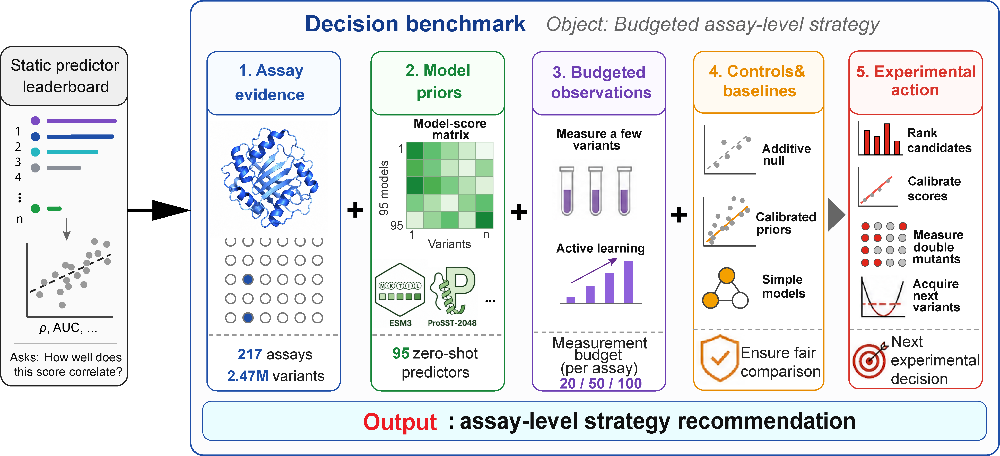
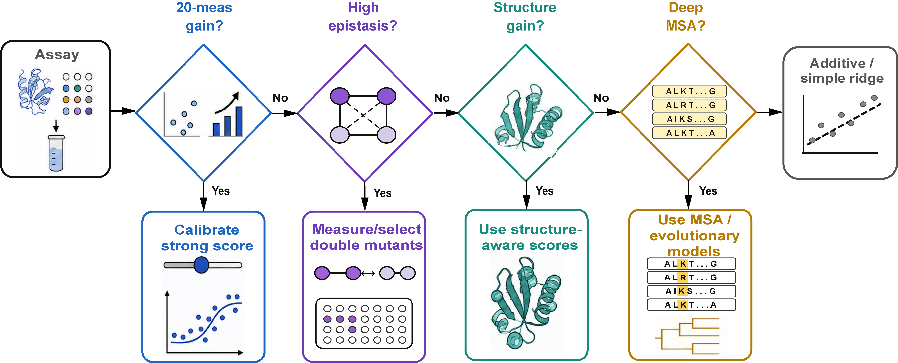

# Protein decision benchmark code and result files

This repository contains the experiment and analysis scripts used in the project, together with the result files that are explicitly referenced by path fields in the corresponding supplementary table records.



## Project overview

The benchmark evaluates protein variant prediction as a decision problem. Instead of asking only which model has the best static score, the project asks which strategy should be used for an assay under a limited measurement budget.

The main analysis workflow covers:

1. zero-shot ranking of variants before target-assay measurements are used;
2. few-measurement calibration and supervised baselines;
3. additive controls for single-mutant and multi-mutant interpretation;
4. epistasis and multi-mutant regimes where additivity is less informative;
5. double-mutant measurement value under matched training and evaluation settings;
6. retrospective active learning for top-variant discovery;
7. structure, alignment-depth and assay-level features used to build a recommendation map;
8. statistical summaries.



## Folder layout

```text
git/
  README.md
  data_download/
    download_proteingym.sh
  scripts/
    *.py
  results/
    active_learning/
    double_data_value/
    external_wrappers/
    low_n/
    multi_evolve_style/
    statistics/
    structure_proxy/
  manifests/
    code_manifest.csv
    excluded_code_manifest.csv
    result_path_sources.csv
    result_manifest.csv
    audit_report.md
    final_audit.json
```

## Included code

The `scripts/` directory contains project experiment and analysis scripts. 

### Data preparation and metadata

- `prepare_batch0.py`: builds the main assay-level working inputs used by downstream analyses.
- `build_official_assay_metadata.py`: prepares assay metadata from official ProteinGym records.
- `curate_assay_types.py` and `refine_assay_type_curation.py`: curate assay-type labels used for stratified summaries.
- `build_assay_strata.py`: creates assay-level strata used in downstream comparisons.
- `build_msa_depth_table.py`: summarizes alignment-depth features.
- `qc_results.py`: performs basic result-quality checks.

### Zero-shot score evaluation

- `run_zero_shot_baselines.py`: computes continuous zero-shot ranking metrics.
- `run_zero_shot_binary_metrics.py`: computes binary-label metrics where binary labels are available.
- `run_zero_shot_extended_metrics.py`: computes additional design-oriented zero-shot metrics.
- `summarize_zero_shot.py` and `summarize_zero_shot_binary.py`: summarize zero-shot performance across assays and methods.

### Few-measurement calibration and supervised baselines

- `run_low_n_calibration.py`: fits simple calibration models after small target-assay measurement budgets.
- `run_low_n_calibration_fast_design.py`: computes design-focused low-measurement summaries.
- `run_low_n_supervised_baselines.py` and `run_low_n_sklearn_baselines.py`: run supervised baseline models under few-measurement settings.
- `run_multi_zscore_ridge.py`: evaluates ridge models that combine multiple precomputed zero-shot scores.
- `add_low_n_percentile_metrics.py`: adds percentile-based discovery metrics.
- `summarize_low_n.py` and `summarize_low_n_percentile.py`: summarize low-measurement calibration and supervised-model outputs.

### Additive controls, epistasis and multi-mutant analyses

- `run_additive_lookup_baseline.py`: builds the additive control from measured single-mutant effects.
- `build_epistasis_residuals.py`: computes strict double-mutant additive predictions and epistatic residuals.
- `analyze_epistasis_zero_shot.py`: compares zero-shot scores with additive and epistatic quantities.
- `analyze_high_residual_subset.py`: evaluates high-residual double-mutant subsets.
- `analyze_sign_epistasis_subset.py`: evaluates sign-epistasis candidate subsets.
- `analyze_reciprocal_sign_epistasis.py`: evaluates reciprocal-sign candidate regimes.
- `run_single_to_multi_metrics.py`: measures single-to-multi-mutant generalization.
- `summarize_epistasis.py`, `summarize_high_residual_subset.py` and `summarize_single_to_multi.py`: aggregate multi-mutant results.

### Double-mutant measurement value

- `analyze_double_data_value.py`: compares models trained with or without measured double mutants under matched settings.
- `analyze_informative_double_selection.py`: evaluates double-mutant selection rules.
- `run_pairwise_residual_baseline.py` and `run_pairwise_plm_residual_baseline.py`: evaluate residual-style multi-mutant baselines.
- `summarize_pairwise_residual.py`: summarizes pairwise-residual controls.

### Active learning and uncertainty-aware acquisition

- `select_active_learning_assays.py`: selects assays used in retrospective active-learning simulations.
- `run_active_learning_simulation.py`: runs iterative acquisition simulations.
- `summarize_active_learning.py` and `summarize_active_learning_hit_time.py`: summarize active-learning trajectories and hit times.
- `analyze_epistatic_hit_discovery.py`: evaluates discovery of high-fitness variants in epistatic settings.
- `analyze_epistatic_uncertainty.py`: evaluates whether disagreement signals enrich epistatic residual regimes.
- `build_uncertainty_tables.py`: builds uncertainty-analysis outputs.

### Structure, decision map, statistics and external methods

- `build_structure_contact_features.py`, `build_structure_asa_features.py`, `build_structure_sasa_features.py` and `build_structure_proxy_analysis.py`: compute structure-derived assay features.
- `analyze_structure_contact_gain.py` and `analyze_structure_asa_gain.py`: evaluate structure-associated performance patterns.
- `build_decision_map_table.py`: creates assay-level decision features and strategy recommendations.
- `analyze_decision_map_rules.py`, `analyze_decision_map_stability.py` and `analyze_decision_map_strata.py`: evaluate decision-map rules, stability and assay strata.
- `build_final_statistical_tests.py` and `run_selected_paired_tests.py`: generate statistical summaries and selected paired tests.
- `build_competitor_wrapper_feasibility.py` and `prepare_evolvepro_dms_inputs.py`: prepare external-method feasibility records and wrapper inputs.
- `summarize_by_assay_type.py` and `summarize_by_strata.py`: summarize results across assay groups.
- `combine_csv.py`: utility for combining CSV outputs.

## Included result files

The `results/` directory contains only result files that are explicitly referenced by `results/...` paths in the current supplementary table records. These files are copied with the same relative path structure used in the original project.

### Active learning

- `results/active_learning/active_learning_summary_seeds0_4.csv`
- `results/active_learning/active_learning_hit_time_summary_seeds0_4.csv`
- `results/active_learning/active_learning_representative_metrics_seeds0_4.csv`
- `results/active_learning/active_learning_uncertainty_acquisition_summary_seeds0_4.csv`
- `results/active_learning/active_learning_uncertainty_acquisition_hit_time_seeds0_4.csv`

### Double-mutant measurement value

- `results/double_data_value/single_plus_double_delta_summary.csv`
- `results/double_data_value/informative_double_selection_heldout_summary.csv`

### Few-measurement supervised and score-combination results

- `results/low_n/low_n_all_supervised_combined_nongiant_percentile_summary.csv`
- `results/low_n/low_n_multi_zscore_ridge_nongiant_metrics.csv`
- `results/low_n/low_n_multi_zscore_ridge_nongiant_metrics.percentile.csv`
- `results/low_n/low_n_multi_zscore_ridge_nongiant_percentile_summary.csv`

### Pairwise and multi-mutant residual analyses

- `results/multi_evolve_style/pairwise_residual_higher_order_metrics.csv`
- `results/multi_evolve_style/pairwise_residual_higher_order_summary.csv`
- `results/multi_evolve_style/pairwise_plm_residual_higher_order_metrics.csv`
- `results/multi_evolve_style/pairwise_plm_residual_higher_order_summary.csv`

### Statistical summaries

- `results/statistics/zero_shot_abs_spearman_ci.csv`
- `results/statistics/single_to_multi_abs_spearman_ci.csv`
- `results/statistics/active_learning_top1pct_found_ci.csv`
- `results/statistics/final_added_bootstrap_ci.csv`
- `results/statistics/final_added_paired_tests.csv`
- `results/statistics/selected_paired_tests.csv`

### Structure-associated result files

- `results/structure_proxy/assay_structure_contact_features.csv`
- `results/structure_proxy/assay_structure_asa_features.csv`

## Expected inputs for a full rerun

A full rerun requires upstream resources that are not duplicated here:

- raw ProteinGym assay files;
- computed zero-shot score files;
- optional MSA files;
- optional local structure files;
- Python scientific computing dependencies such as scipy.

The helper script `data_download/download_proteingym.sh` documents the ProteinGym archive names used by the project, but the downloaded archives are not included in this folder.
