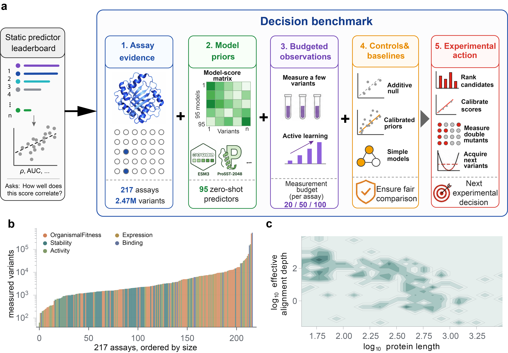
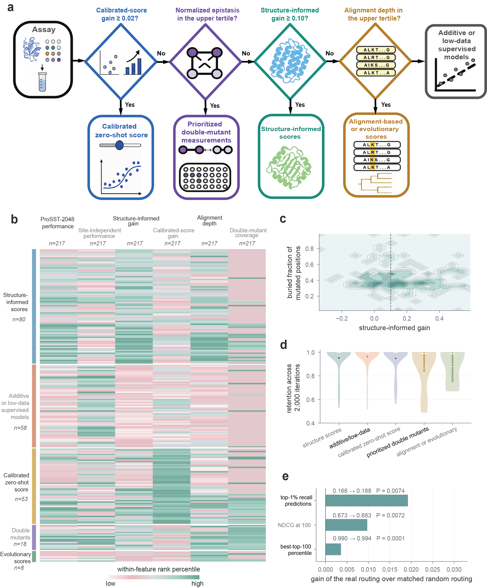

# Measurement depth reshapes the utility of protein foundation models for protein engineering

Analysis code for **Measurement depth reshapes the utility of protein foundation models for protein engineering**. The benchmark connects protein variant prediction to experimental design: which predictor is useful at a given measurement budget, when measured component effects change that choice, and how subsequent measurements improve discovery.

The study identifies a measurement-depth crossover between model priors and measured single-mutant additivity. Calibrated priors provide an advantage at small budgets; as component measurements accumulate, additivity overtakes zero-shot references, earlier for top-variant discovery than for global ranking. The analyses follow this changing information budget through calibration, biological controls, double-mutant measurement and iterative acquisition.

| Benchmark dimension | Coverage |
| --- | --- |
| Experimental data | 217 ProteinGym substitution assays; 2,465,767 measured variants |
| Model priors | 95 precomputed zero-shot predictors |
| Few-measurement comparisons | Budgets of 20, 50 and 100 variants; five split replicates |
| Active learning on shared pools | 27 assays; 20 initial measurements followed by five batches of ten |
| Decision metrics | Global ranking, top-variant recovery, shortlist quality and acquisition efficiency |



## Repository contents

The repository provides 100 Python analysis scripts, selected result tables, environment specifications and two overview figures. Scripts cover data preparation, model evaluation, statistical comparisons and assay-level strategy assignment. Some also generate plots alongside their numerical outputs.

```text
data_download/   ProteinGym download script
environment/     Python dependency specifications
scripts/         Analysis scripts
results/         Selected computed results
pics/            Benchmark overview and decision map
LICENSE          MIT license
```

## Getting started

Run the commands below from the repository root. The core analyses use Python 3.10 or later.

### 1. Create the analysis environment

```bash
conda env create -f environment/environment.yml
conda activate decision-benchmark
```

Alternatively, install the dependencies in an existing Python environment:

```bash
python -m pip install -r environment/requirements.txt
```

The environment files specify minimum dependency versions. Analyses that read HDF5 embeddings additionally require `h5py`:

```bash
python -m pip install h5py
```

ProteinNPT and Kermut runs use the published implementations and their own environments, pretrained resources and model dependencies. See [External models and additional resources](#external-models-and-additional-resources).

### 2. Download the ProteinGym inputs

The download script targets ProteinGym v1.3 and retrieves substitution assays, precomputed zero-shot scores and multiple-sequence alignments. Dataset documentation and reference files are available from the [official ProteinGym repository](https://github.com/OATML-Markslab/ProteinGym).

The downloader writes into its current directory. Run it inside `proteingym/` to match the analysis paths:

```bash
mkdir -p proteingym
(
  cd proteingym
  bash ../data_download/download_proteingym.sh
)
```

It creates `proteingym/zips/`, `proteingym/extracted/` and `proteingym/logs/`. Prepare the predictor inventory, assay manifest and training splits:

```bash
python scripts/prepare_batch0.py --extract-zero-shot --make-splits \
  --budgets 20,50,100 --seeds 0,1,2,3,4
```

The main input layout is:

```text
proteingym/
  zips/
    DMS_ProteinGym_substitutions.zip
    zero_shot_substitutions_scores.zip
    DMS_msa_files.zip
  extracted/
    DMS_ProteinGym_substitutions/
    zero_shot_substitutions_scores/
    DMS_msa_files/
results/
  batch0/
    assay_manifest.csv
    method_inventory.csv
  splits/
    low_n_splits.csv
```

The preparation step extracts zero-shot score files into the directory expected by the downstream scripts. Retain the score archive: preparation and several evaluation scripts also read it directly.

### 3. Evaluate zero-shot predictors

Use `--all-methods` to evaluate every predictor in the supplied score tables. Without this option, the script uses its default representative panel.

```bash
python scripts/run_zero_shot_baselines.py --all-methods --workers 4 \
  --out results/zero_shot/zero_shot_all_methods_metrics.csv

python scripts/summarize_zero_shot.py \
  --metrics results/zero_shot/zero_shot_all_methods_metrics.csv
```

The output contains within-assay correlations and top-candidate metrics. The explicit output filename connects the evaluation to the summary script. Use `--assays` to select assay CSV filenames and `--methods` to select score-column names for a smaller run.

### 4. Run a small calibration example

This example fits ProSST-2048 calibration and its additive comparisons on the first assay in the generated splits:

```bash
python scripts/run_low_n_calibration.py --methods ProSST-2048 \
  --limit-assays 1 --workers 1 \
  --out results/low_n/calibration_example.csv

python scripts/add_low_n_percentile_metrics.py \
  --inputs results/low_n/calibration_example.csv

python scripts/summarize_low_n.py \
  --inputs results/low_n/calibration_example.csv \
  --out results/low_n/calibration_example_summary.csv
```

Remove `--limit-assays 1` to process all prepared assays and set `--methods` to the desired predictor panel. Training membership, budgets and replicates come from `results/splits/low_n_splits.csv`. Use `--help` on these command-line entry points to inspect their options.

## Analysis guide

The analyses form six linked stages, from evaluating a prior to choosing the next measurement. Script links below point to the main entry points; each script defines its required inputs and output paths.

### 1. Define the experimental decision

[prepare_batch0.py](scripts/prepare_batch0.py) inventories assays and predictors and generates measurement splits. [build_official_assay_metadata.py](scripts/build_official_assay_metadata.py), [build_assay_strata.py](scripts/build_assay_strata.py) and [build_msa_depth_table.py](scripts/build_msa_depth_table.py) prepare assay annotations, strata and alignment-depth features. Assay-type curation is handled by `curate_assay_types.py` and `refine_assay_type_curation.py`.

A comparison is defined by its assay, candidate pool, measured training variants, model inputs and decision metric. Ranking and discovery are evaluated separately. In double-mutant selection experiments, measured component singles provide side information in addition to the stated double-mutant budget.

### 2. Adapt model priors to a measurement budget

[run_zero_shot_baselines.py](scripts/run_zero_shot_baselines.py) evaluates global ranking and top-candidate recovery. `run_zero_shot_binary_metrics.py` adds binary discrimination, `run_zero_shot_extended_metrics.py` adds enrichment and standardized-error summaries, and `check_score_orientation.py` examines score direction.

[run_low_n_calibration.py](scripts/run_low_n_calibration.py) fits single-score and additive-plus-score calibration. `run_low_n_calibration_fast_design.py` evaluates discovery on deterministically sampled candidates for large assays. [run_low_n_supervised_baselines.py](scripts/run_low_n_supervised_baselines.py), [run_low_n_sklearn_baselines.py](scripts/run_low_n_sklearn_baselines.py) and [run_multi_zscore_ridge.py](scripts/run_multi_zscore_ridge.py) compare mutation-identity, additive and score-based features under different regressors.

[run_matched_budget_embedding_baselines.py](scripts/run_matched_budget_embedding_baselines.py) holds ESM2-650M embeddings, measured variants and held-out candidates fixed while comparing regressors. [summarize_native_supervised_baselines.py](scripts/summarize_native_supervised_baselines.py) summarizes the official ProteinGym supervised outputs across proteins and split schemes.

### 3. Locate the measurement-depth crossover

[build_epistasis_residuals.py](scripts/build_epistasis_residuals.py) constructs additive expectations and residuals for component-resolved double mutants. [run_additive_lookup_baseline.py](scripts/run_additive_lookup_baseline.py) and [run_single_to_multi_metrics.py](scripts/run_single_to_multi_metrics.py) evaluate measured additivity and prediction across mutation orders.

[additive_control_crossover.py](scripts/additive_control_crossover.py) varies the number of measured component singles within fixed assay cohorts. It measures when additivity reaches zero-shot references for ranking and discovery. [additive_control_matched_information.py](scripts/additive_control_matched_information.py) gives additivity, calibrated priors and their combinations identical measured singles and held-out doubles at budgets of 20, 50 and 100.

`analyze_epistasis_zero_shot.py`, `analyze_high_residual_subset.py`, `analyze_sign_epistasis_subset.py` and `analyze_reciprocal_sign_epistasis.py` evaluate interaction-enriched subsets. [reciprocal_sign_analysis.py](scripts/reciprocal_sign_analysis.py) provides paired assay-level comparisons, and [higher_order_robustness.py](scripts/higher_order_robustness.py) examines higher-order rankings under stratification and alternative aggregation.

### 4. Test the value of double-mutant measurements

[analyze_double_data_value.py](scripts/analyze_double_data_value.py) compares models trained with and without measured doubles. [analyze_double_selection_scope_fast.py](scripts/analyze_double_selection_scope_fast.py) evaluates five selection rules and four downstream models on a shared holdout; `analyze_double_selection_scope.py` and `analyze_double_selection_scope_parallel.py` provide related implementations. `analyze_informative_double_selection.py` evaluates pair-residual selection with the unselected variants used for evaluation.

[run_pairwise_residual_baseline.py](scripts/run_pairwise_residual_baseline.py) and [run_pairwise_plm_residual_baseline.py](scripts/run_pairwise_plm_residual_baseline.py) test transfer from measured pairs to higher-order variants. `build_selected_double_splits.py`, `build_kermut_compatible_selected_double_splits.py` and `summarize_selected_double_external.py` prepare and summarize the selected-double comparisons for external models.

### 5. Evaluate successive acquisition decisions

[analyze_signed_residual_enrichment.py](scripts/analyze_signed_residual_enrichment.py) measures which residual classes are enriched by prediction-level and disagreement scores. Related diagnostics are implemented in `analyze_epistatic_uncertainty.py`, `analyze_epistatic_hit_discovery.py` and `build_uncertainty_tables.py`.

[select_active_learning_assays.py](scripts/select_active_learning_assays.py) selects assays by composition. [run_active_learning_simulation.py](scripts/run_active_learning_simulation.py) evaluates ensemble acquisition rules. [run_common_pool_active_learning_comparison.py](scripts/run_common_pool_active_learning_comparison.py) compares these rules with adapted ALDE and EVOLVEpro policies on identical candidate pools and starting measurements, using `run_alde_style_active_learning.py` and `run_evolvepro_style_active_learning.py`.

[active_learning_power.py](scripts/active_learning_power.py) calculates discovery, trajectory area, measurement efficiency, final rank gap and seed-resampling summaries. `summarize_active_learning.py`, `summarize_active_learning_hit_time.py` and `summarize_active_learning_targeted_contrasts.py` provide trajectory, first-hit and paired-policy summaries.

### 6. Assign and evaluate assay-level starting strategies

[build_decision_map_table.py](scripts/build_decision_map_table.py) combines calibration gain, normalized epistasis, structure-informed gain and alignment depth in a fixed-priority rule. The first satisfied condition assigns an assay-level starting strategy.

[validate_decision_map_generalization.py](scripts/validate_decision_map_generalization.py) measures assignment retention after leaving out proteins when estimating thresholds and under protein-clustered threshold perturbations. [decision_map_benefit_robustness.py](scripts/decision_map_benefit_robustness.py) compares routing outcomes with 10,000 label permutations that preserve category sizes. [decision_map_benefit_test.py](scripts/decision_map_benefit_test.py) compares routing with fixed strategy representatives and a per-assay oracle over those representatives.

`analyze_decision_map_rules.py`, `analyze_decision_map_stability.py` and `analyze_decision_map_strata.py` summarize rule behavior and assay groups. `decision_map_proxy_sensitivity.py` tests alternative definitions of epistasis evidence. `decision_map_completion.py` examines gains from double-mutant measurements in recommended assays and evaluates a learned routing alternative with protein-grouped cross-validation.

Structure and exposure features are computed by `build_structure_contact_features.py`, `build_structure_asa_features.py`, `build_structure_sasa_features.py` and `build_structure_proxy_analysis.py`. `analyze_structure_contact_gain.py` and `analyze_structure_asa_gain.py` relate these features to predictor performance.



### Statistical summaries

[build_final_statistical_tests.py](scripts/build_final_statistical_tests.py) and [run_selected_paired_tests.py](scripts/run_selected_paired_tests.py) calculate bootstrap intervals and paired sign-permutation tests with Benjamini–Hochberg adjustment. `check_split_and_protein_robustness.py` examines split schemes and protein-level aggregation. `qc_results.py` checks result completeness, and `combine_csv.py` combines partial runs. Analysis-specific tests and resampling settings are also defined in the corresponding scripts.

## Inputs for downstream analyses

Nine scripts read organized analysis tables through `PROTEIN_DECISION_PACKAGE`: the two additive-control analyses, higher-order and reciprocal-sign analyses, acquisition endpoint analysis, and four decision-map analyses. By default, this directory is `analysis_package/` at the repository root. Set the environment variable to an existing directory with the same layout to use a different location.

These derived inputs are separate from the raw ProteinGym download and are not bundled in this checkout. Prepare the relevant tables before running the corresponding scripts. Their expected layout is:

```text
analysis_package/
  low_measurement_metrics.csv
  benchmark_definition/
    methods/method_inventory.csv
  multi_mutant/
    double_residuals/strict_double_epistasis_residuals.csv
    regime_summaries/reciprocal_sign_epistasis_candidates.csv
    regime_summaries/reciprocal_sign_epistasis_summary.csv
    single_to_multi/single_to_multi_representative_metrics.csv
    single_to_multi/single_to_multi_summary.csv
    figure_regime_map/source_higher_order_ranking.csv
  active_learning/
    common_pool_active_learning/
      active_learning_external_common_pool_metrics.csv
      active_learning_external_common_pool_hit_time.csv
  decision_map/
    final_assignments/assay_strategy_recommendations.csv
  global_data/
    double_mutant_measurements/
      measurement_value/single_plus_double_delta_detail.csv
    decision_map/
      assay_features/assay_decision_features.csv
      final_assignments/assay_strategy_recommendations.csv
```

`decision_map_completion.py` reads its feature, assignment and measurement-value tables under `global_data/`; the other decision-map scripts use the top-level `decision_map/` directory. Outputs from these nine scripts are written to `results/experiments/`.

## External models and additional resources

The metadata, structural and external-model analyses use the following inputs in addition to the downloaded assay and score files:

| Input | Expected location |
| --- | --- |
| ProteinGym substitution reference metadata | `proteingym/reference_DMS_substitutions.csv` |
| Structure files | `proteingym/structures/AF2/` or `proteingym/structures/` |
| Kermut implementation and resources | `external_repos/kermut/` |
| ESM2-650M embedding caches | `external_repos/kermut/data/embeddings/` |
| ProteinNPT implementation and resources | `external_repos/ProteinNPT/` |

Obtain the reference metadata and structural resources corresponding to the ProteinGym dataset used for the analysis. Kermut requires its embeddings, zero-shot fitness predictions, ProteinMPNN conditional probabilities and structural coordinates. ProteinNPT requires its alignment resources, model weights and supporting tools; its launcher exposes environment and resource options.

[run_kermut_matched_budget.py](scripts/run_kermut_matched_budget.py) and [run_proteinnpt_matched_budget.py](scripts/run_proteinnpt_matched_budget.py) perform the budgeted fits. The associated preparation, embedding, comparison and summary scripts assemble their inputs and evaluate matched outcomes. [build_sota_integration_data_and_figure.py](scripts/build_sota_integration_data_and_figure.py) combines external-model summaries, paired tests and plots.
